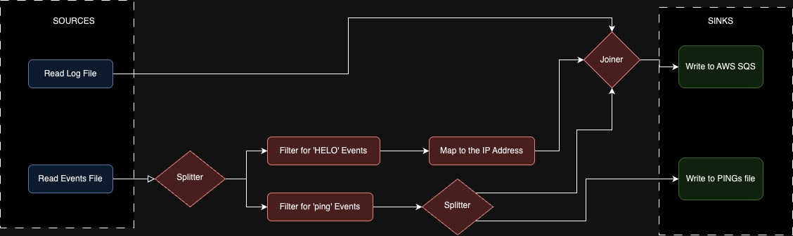

## PETaL - Python Extract Transform and Load

A framework to compose custom ETLs on top of a logical floor.

Follow along in the `/examples` directory to build up arbitrary pipelines.

(This is modeled on Airflow's DAG Operator model for intuitive composition in Python.)

## Getting Started 

### 01. Trivial Case

```python
# Let's start with the most trivial pipeline possible:
# - a Source that produces nothing
# - s Sink that does nothing with its input
# This is just to demonstrate the structure of a Petal pipeline

# First, we define the pipeline context manager.
# All the code in the inner block will get scoped to this object, automagically registering itself to the ETL!
with Pipeline("01_noop") as dag:
    # Inside the Pipeline context, we define operators
    # They can be Petal's built-in operators
    # Or we can extend any of Petal's built-ins to support custom use cases
    source = EmptySource("empty_source")  
    sink = NoOpSink("no_op_sink")

    # Once the operators are defined, we compose them into a DAG
    # The >> and << operators signify the direction of flow
    source >> sink  
    # (an equivalent statement would have been: sink << source)  

# Finally we execute the pipeline
dag.run()
```

### 02. Simple Case - Single ETL Step

```python
# Now let's look at a non-trivial case
# We will implement 1 step from each of the ETL (Extract, Transform, Load)
with Pipeline("02_copy_file_to_file") as dag:
    
    # Extract the data from a file - in this case, INFO and WARN logs
    read_logs = FileReader("read_logs", file_path="../data/example_input.txt")
    # Transform the data - filter it to only match lines that start with INFO
    pattern_filter = RegexFilter("filter_info", pattern="^INFO")
    # Load the data into a destination file
    write_to_file = FileWriter("write_file", file_path="../data/example_output.txt")

    # Specify the order of the ETL
    read_logs >> pattern_filter >> write_to_file

dag.run()
```

### 03. One Source, Multiple Sinks

```python
# Until now, we've used linear DAGs but Petal is able to handle any arbitrary DAG
# Let's demonstrate a DAG that branches out into multiple prongs
# There are multiple ways to implement this in Petal, we'll just show one here
with Pipeline("03_splitting_streams_to_multiple_destinations") as dag:
    # We'll read from the same file as before
    read_logs = FileReader("read_logs", file_path="../data/example_input.txt")
    # This is a Splitter operator 
    # It will receive a single input stream and will copy it to N output streams
    splitter = Splitter("split")
    # Under the hood, it uses a deepcopy of the stream - but if you have many output streams
    # and know that the consumers of the streams won't be mutating the data, you can implement
    # a custom Splitter that just propagates the input stream without copying it. 
    # That's the beauty of Petal - easy extensibility!
    
    # To demonstrate the 2 branches of the ETL, we'll apply different transformations to each branch
    # For the first branch, we'll filter for INFO lines just like in example_02
    pattern_filter = RegexFilter("filter_info", pattern="^INFO")
    # Then write it to a file whose name indicates it's filtered
    write_to_file_filtered = FileWriter("write_filtered", file_path="../data/example_output_filtered.txt")
    
    # The other branch will just be a direct copy of the input file - no transformations applied
    write_to_file_unfiltered = FileWriter("write_unfiltered", file_path="../data/example_output_unfiltered.txt")

    # Here's how we define the DAG:
    # The reader will extract the source data into the Splitter
    read_logs >> splitter
    
    # And then the Splitter will act like a source itself
    # So we can write two branches of the ETL from the Splitter
    # First branch passes through the filter, then to the filtered file
    splitter >> pattern_filter >> write_to_file_filtered
    # And the second branch just copies directly from the Splitter to the unfiltered file 
    splitter >> write_to_file_unfiltered

dag.run()
```

### 04. Multiple Sources, One Sink

```python
# In example_03 we split streams up - now we want the ability to join streams together as well
# However, joining streams is not trivial - we need to make decisions on how the data is combined
with Pipeline("example_04_joining_multiple_streams_into_one") as dag:
    # Let's start with 3 distinct sources
    source_1 = FileReader("source_1", file_path="../data/source_1.txt")
    source_2 = FileReader("source_2", file_path="../data/source_2.txt")
    source_3 = FileReader("source_3", file_path="../data/source_3.txt")

    # This is a subclass of the Joiner operator
    # A generic regular Joiner accepts two inputs - the operator name and a reducer function
    # To implement a StreamJoiner, we can subclass the Joiner and define its reducer function
    # In this case, the reducer function concatenates the data from all the streams
    joiner = StreamJoiner("joiner")

    # As always, we need a Sink
    write_to_file = FileWriter("write_to_file", file_path="../data/all_concatenated.txt")

    # We read all the Sources into the Joiner
    source_1 >> joiner
    source_2 >> joiner
    source_3 >> joiner
    
    # Then route the Joiner to the Sink. As the data passes through, it's `process()` method
    # will execute the reducer function on the inputs and reduce them to a single output stream.
    joiner >> write_to_file

dag.run()
```

### 05. Putting It All Together

Consider the following case scenario: you're a software engineer managing the logs for your application running in a VM.
Your app is producing logs, and your VM also logs events, such as connection attempts, pings, app restarts, etc. 

We want to analyze the IP addresses of everyone that interacts with either the app, or the VM directly. 
We want to stream all of the IPs we find to a queue for our data science team to deal with. Separately, 
the OPS team asked us to send them all the PING attempts to the VM so they can cross-reference known threat actors. 

Here's what the diagram looks like - let's use Petal to achieve this!



```python
# We're now ready to compose a complex multi-stage ETL.
with Pipeline("example_05_multi_step_etl") as dag:
    # Let's start with our Sources...
    log_file = FileReader("log_file", file_path="../data/app_logs.txt")
    events_file = FileReader("events_file", file_path="../data/vm_events.txt")

    # ...then the non-terminal operators...
    event_file_splitter = Splitter("event_file_splitter")
    filter_for_helo_lines = RegexFilter("filter_for_helo_lines", "HELO")
    filter_for_ping_events = RegexFilter("filter_for_ping_events", "PING")
    map_to_ip_addr = RegexMapper("map_to_ip_addr", r"(?:[0-9]{1,3}\.){3}[0-9]{1,3}")
    ping_splitter = Splitter("ping_splitter")
    joiner = StreamJoiner("joiner")

    # ...and finally our Sinks
    write_to_ping_file = FileWriter("write_to_ping_file", file_path="../data/detected_pings.txt")
    write_to_sqs = MockSqsWriter("write_to_sqs", "<sqs_queue_name>", "us-east-1")

    # Now let's piece together this DAG
    log_file >> joiner >> write_to_sqs
    events_file >> event_file_splitter
    event_file_splitter >> filter_for_helo_lines >> map_to_ip_addr >> joiner
    event_file_splitter >> filter_for_ping_events >> ping_splitter
    ping_splitter >> joiner
    ping_splitter >> write_to_ping_file

dag.run()
```

### Theory
There are 3 types of Operators - **Sources**, **Sinks**, and **Non-Terminal Operators.**
Pipelines in Petal are wrappers around arbitrary Directed Acyclic Graphs (DAGs). 
A Pipeline is constructed from a DAG and has the following invariants:
1. **It must have at least 1 Operator satisfying each of the terminal operator types (ie. at least 1 Source and 1 Sink).**
2. **Operators are directional (data flows in a particular direction within the Operator).**
3. **Each Operator has a unique ID and a reference to its upstream and downstream Operators.**
4. **There are no cycles in the graph.**

 

## Contributing
After cloning this repo, make sure to run the following:
```bash
pip install -r requirements
pre-commit install  # This will set up the pre-commit hooks 
```

If you have suggestions, open an Issue or a Pull Request. 

https://pypi.org/project/petal-etl-composer/


